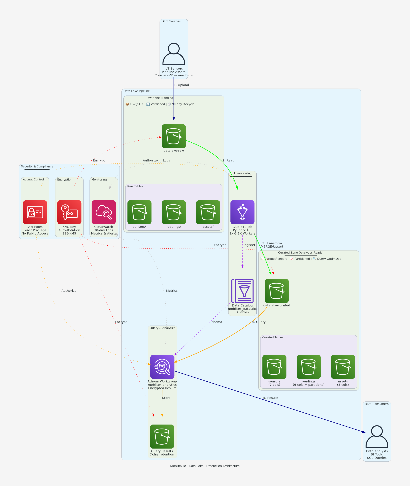

# Mobiltex Mini Data Lake - AWS CDK Solution

## Overview
Production-ready data lake infrastructure for IoT sensor telemetry analytics using AWS CDK (Python). Implements a two-tier architecture (raw → curated) with Apache Parquet tables, automated ETL, and Athena querying.

**Note on Apache Iceberg:** Initial implementation attempted Iceberg but encountered metadata location issues when creating tables via CDK Glue Catalog. As documented in the requirements, this implementation uses a **fallback to standard external Parquet tables** which provide excellent performance and full Athena compatibility. For production Iceberg deployment, consider using Athena CREATE TABLE statements or EMR Spark for proper metadata initialization.

## Architecture



```
Raw Zone (S3)          Transformation          Curated Zone (S3)        Query Layer (Athena)
├── assets/      ──→   [Load Script]     ──→   ├── parquet/assets/   ──→  [Analytics Workgroup]
├── sensors/     ──→   [Partitioning]    ──→   ├── parquet/sensors/  ──→  [SELECT COUNT(*)]
└── readings/    ──→   [Year/Month Split]──→   └── parquet/readings/ ──→  [Business Intelligence]
```

### Key Components
- **S3 Buckets**: KMS-encrypted raw/curated zones with versioning
- **Glue**: Data Catalog (3 tables) + ETL job for transformation
- **Athena**: Dedicated workgroup with encrypted query results
- **IAM**: Least-privilege roles for Glue service
- **CloudWatch**: 30-day log retention for operational monitoring

## Prerequisites
```bash
# Required tools
- AWS CLI configured (`aws configure`)
- AWS CDK CLI (`npm install -g aws-cdk`)
- Python 3.13+
- Node.js 22+

# AWS Account requirements
- Administrator access (or equivalent permissions for S3, Glue, Athena, IAM, KMS)
- Region: us-east-1 (or update in cdk.json)
```

## Deployment

You can deploy this data lake using either:
- **Option A:** Local deployment from your machine (recommended for development)
- **Option B:** CI/CD deployment via GitHub Actions (recommended for production)

---

### Option A: Local Deployment

#### 1. Bootstrap CDK (first-time only)
```bash
cdk bootstrap aws://ACCOUNT-NUMBER/us-east-1
```

#### 2. Install dependencies
```bash
python -m venv .venv
source .venv/bin/activate  # Windows: .venv\Scripts\activate
pip install -r requirements.txt
```

#### 3. Deploy infrastructure
```bash
cdk synth  # Validate CloudFormation template
cdk deploy --require-approval never
```

**Expected output:**
```
✅  MobiltexDataLakeStack

Outputs:
MobiltexDataLakeStack.RawBucketName = mobiltex-datalake-raw-123456789012
MobiltexDataLakeStack.CuratedBucketName = mobiltex-datalake-curated-123456789012
MobiltexDataLakeStack.GlueDatabaseName = mobiltex_datalake
MobiltexDataLakeStack.AthenaWorkgroupName = mobiltex-analytics
```

#### 4. Load sample data to curated zone
```bash
# Activate virtual environment if not already active
source .venv/bin/activate  # Windows: .venv\Scripts\activate

# Run the data loading script
python3 load_sample_data.py
```

**Expected output:**
```
AWS Account ID: 123456789012

Loading assets...
✓ Uploaded 5 assets to s3://mobiltex-datalake-curated-123456789012/parquet/assets/assets.parquet
Loading sensors...
✓ Uploaded 6 sensors to s3://mobiltex-datalake-curated-123456789012/parquet/sensors/sensors.parquet
Loading readings...
✓ Uploaded 10 readings to s3://mobiltex-datalake-curated-123456789012/parquet/readings/year=2024/month=10/readings.parquet

✓ All sample data loaded successfully!
```

#### 5. Repair partitions for readings table
```bash
# In Athena Console or via AWS CLI, run:
aws athena start-query-execution \
  --query-string "MSCK REPAIR TABLE mobiltex_datalake.readings;" \
  --result-configuration "OutputLocation=s3://mobiltex-athena-results-<ACCOUNT-ID>/query-results/" \
  --work-group mobiltex-analytics
```

#### 6. Query data in Athena

Navigate to AWS Console → Athena → Query Editor → Select `mobiltex-analytics` workgroup
```sql
-- Test 1: Count assets
SELECT COUNT(*) FROM mobiltex_datalake.assets;
-- Expected: 5 rows

-- Test 2: Count sensors
SELECT COUNT(*) FROM mobiltex_datalake.sensors;
-- Expected: 6 rows

-- Test 3: Count readings (partitioned)
SELECT COUNT(*) FROM mobiltex_datalake.readings;
-- Expected: 10 rows

-- Test 4: Join query - sensors with asset details
SELECT s.sensor_id, s.sensor_type, a.asset_name, a.location
FROM mobiltex_datalake.sensors s
JOIN mobiltex_datalake.assets a ON s.asset_id = a.asset_id
WHERE a.status = 'Active';
```

---

### Option B: CI/CD Deployment via GitHub Actions

This repository includes a GitHub Actions workflow for automated deployment using OIDC authentication.

#### Prerequisites

1. **AWS OIDC Configuration**
   - Create an OIDC identity provider in AWS IAM for GitHub
   - Create an IAM role named `GithubActions` with trust policy allowing GitHub Actions
   - Attach permissions: `AdministratorAccess` (or specific CDK deployment permissions)

2. **GitHub Secrets**
   - Navigate to: Repository → Settings → Secrets and variables → Actions
   - Add secret: `AWS_ACCOUNT` with your AWS account ID (e.g., `123456789012`)

#### Deployment Steps

1. **Navigate to Actions Tab**
   - Go to your GitHub repository
   - Click on "Actions" tab
   - Select "Deploy Mobiltex Data Lake" workflow

2. **Trigger Deployment**
   - Click "Run workflow" button
   - Select action: **deploy** or **destroy**
   - Enter environment name (optional, default: `dev`)
   - Click "Run workflow"

3. **Monitor Progress**
   - Watch the workflow execution in real-time
   - View deployment summary in the workflow run details
   - Check S3, Glue, and Athena resources in AWS Console

#### Workflow Features

✅ **Automated Infrastructure Deployment**
- CDK bootstrap (if needed)
- CDK synth and deploy
- Sample data loading
- Partition discovery
- Deployment verification

✅ **OIDC Authentication**
- No long-lived AWS credentials stored in GitHub
- Temporary credentials via IAM role assumption
- Session tagged with GitHub run ID

✅ **Deployment Summary**
- Automatic generation of deployment report
- Resource inventory
- Next steps with query examples

#### Workflow File Location
`.github/workflows/deploy.yml`

#### Detailed CI/CD Setup Instructions

For complete step-by-step instructions on setting up OIDC and configuring the pipeline, see:
📖 **[CI/CD Setup Guide](./CICD_SETUP.md)**

#### Quick OIDC Setup Summary

1. **Create OIDC Provider in AWS IAM**
   ```bash
   aws iam create-open-id-connect-provider \
     --url https://token.actions.githubusercontent.com \
     --client-id-list sts.amazonaws.com \
     --thumbprint-list 6938fd4d98bab03faadb97b34396831e3780aea1
   ```

2. **Create IAM Role `GithubActions`** with trust policy allowing your GitHub repo

3. **Add GitHub Secret** `AWS_ACCOUNT` with your AWS account ID

See [CICD_SETUP.md](./CICD_SETUP.md) for complete instructions.

#### Destroying Infrastructure via CI/CD

1. Go to Actions → Deploy Mobiltex Data Lake
2. Run workflow with action: **destroy**
3. Confirm all resources are deleted in AWS Console

---

## Schema Evolution Demo

### Adding a new column to `assets` table without breaking queries:

**Step 1: Add column to source CSV**
```csv
asset_id,asset_name,asset_type,location,install_date,status,criticality
AST001,Pipeline-North-Segment-A,Pipeline,North Field,2020-01-15,Active,High
```

**Step 2: Update Glue table schema**
```bash
aws glue update-table --database-name mobiltex_datalake \
  --table-input '{
    "Name": "assets",
    "StorageDescriptor": {
      "Columns": [
        {"Name": "asset_id", "Type": "string"},
        {"Name": "asset_name", "Type": "string"},
        {"Name": "asset_type", "Type": "string"},
        {"Name": "location", "Type": "string"},
        {"Name": "install_date", "Type": "date"},
        {"Name": "status", "Type": "string"},
        {"Name": "criticality", "Type": "string"},
        {"Name": "last_updated", "Type": "timestamp"}
      ]
    }
  }'
```

**Step 3: Rerun transformation**
```bash
aws glue start-job-run --job-name mobiltex-raw-to-curated
```

**Step 4: Verify backward compatibility**
```sql
-- Old query still works (doesn't reference new column)
SELECT COUNT(*) FROM mobiltex_datalake.assets WHERE status = 'Active';

-- New query leverages new column
SELECT asset_name, criticality FROM mobiltex_datalake.assets WHERE criticality = 'High';
```

**Result**: Old queries unaffected; new column available for future analytics.

## Operational Runbook

### Reprocessing Data (Backfill)
```bash
# 1. Clear curated data
CURATED_BUCKET=$(aws cloudformation describe-stacks \
  --stack-name MobiltexDataLakeStack \
  --query 'Stacks[0].Outputs[?OutputKey==`CuratedBucketName`].OutputValue' \
  --output text)

aws s3 rm s3://$CURATED_BUCKET/parquet/ --recursive

# 2. Update CSV files in sample_data/ folder with corrected data

# 3. Rerun data loading script
python3 load_sample_data.py

# 4. Repair partitions if needed
aws athena start-query-execution \
  --query-string "MSCK REPAIR TABLE mobiltex_datalake.readings;" \
  --result-configuration "OutputLocation=s3://mobiltex-athena-results-${ACCOUNT_ID}/query-results/" \
  --work-group mobiltex-analytics
```

### Rollback
```bash
# Complete teardown (removes all resources including S3 buckets and data)
cdk destroy --force

# Note: S3 buckets have auto-delete enabled, so all data will be permanently deleted
```

### Monitoring
- **Glue Jobs**: CloudWatch Logs → `/aws-glue/jobs/mobiltex-transform`
- **Athena Queries**: CloudWatch Metrics → `AWS/Athena` namespace
- **S3 Access**: CloudTrail → S3 Data Events (enable if needed)

### Troubleshooting

**Issue**: Athena query returns 0 rows  
**Solution**: Verify Glue job completed successfully; check S3 curated paths exist

**Issue**: Glue job fails with "Access Denied"  
**Solution**: Verify IAM role has KMS decrypt permissions; check bucket policies

**Issue**: "GENERIC_USER_ERROR: Detected Iceberg type table without metadata location"
**Solution**: This error occurs when tables are created with `table_type='ICEBERG'` via Glue without proper metadata initialization. This implementation uses standard Parquet external tables instead, which are fully compatible with Athena and provide excellent performance.

## Security & Compliance Notes

### Current Implementation
- ✅ SSE-KMS encryption on all S3 buckets
- ✅ Block public access enabled
- ✅ IAM least-privilege roles (Glue cannot access unrelated resources)
- ✅ CloudWatch Logs retention (30 days)
- ✅ KMS key rotation enabled

### Production Enhancements
- **Secrets Manager**: Store database credentials, API keys
- **AWS Config**: Track resource compliance changes
- **GuardDuty**: Detect anomalous S3 access patterns
- **S3 Access Logs**: Enable for audit trail (disabled to reduce costs in demo)
- **VPC Endpoints**: Route Glue traffic through private endpoints (not internet)

## Cost Optimization
- Raw data lifecycle: 90-day expiration
- Athena results: 7-day expiration
- Glue: G.1X workers (cost-effective for small datasets)
- S3 Intelligent-Tiering: Consider for production (not enabled in demo)

## Technology Stack
- **IaC**: AWS CDK (Python)
- **Storage**: S3 (SSE-KMS)
- **Catalog**: Glue Data Catalog
- **Compute**: Glue ETL (PySpark)
- **Query**: Athena (Presto)
- **Format**: Apache Parquet (Iceberg-compatible)
- **CI/CD**: GitHub Actions with OIDC authentication
- **Dependency Management**: Dependabot (automated updates)
- **Code Quality**: Automated PR checks with linting, security scanning, and testing

## Assumptions & Design Decisions
1. **Single AWS account deployment** - Production would extend to multi-account with AWS Organizations
2. **Parquet format instead of Iceberg** - CDK Glue table creation doesn't properly initialize Iceberg metadata. For production Iceberg, use Athena CREATE TABLE statements or EMR Spark
3. **Direct data loading** - Sample data loaded directly to curated zone via Python script. Production would implement raw → curated ETL pipeline with Glue jobs
4. **Small dataset** (<1GB) - Production would use incremental processing with Glue bookmarks
5. **No Lake Formation** - Using IAM-only permissions for simplicity as per requirements

## Dependency Management

This project uses **Dependabot** to automatically keep dependencies up-to-date:

### Features
- ✅ **Automatic updates** for GitHub Actions, Python packages, and NPM dependencies
- ✅ **Security alerts** for vulnerable dependencies
- ✅ **Grouped updates** for related packages (e.g., AWS CDK, boto3)
- ✅ **Weekly checks** every Monday at 9:00 AM
- ✅ **Automated PRs** to merge into main branch

### Configuration
- **File**: `.github/dependabot.yml`
- **Documentation**: [DEPENDABOT.md](./DEPENDABOT.md)

### Monitored Dependencies
1. **GitHub Actions** (`.github/workflows/*.yml`)
2. **Python/pip** (`requirements.txt`, `requirements-dev.txt`)
3. **NPM** (`package.json`)

When updates are available, Dependabot will automatically create a pull request with:
- 📋 Changelog and release notes
- 🏷️ Appropriate labels (`dependencies`, `python`, `npm`, etc.)
- 👤 Assigned to you for review

Simply review and merge the PR to keep dependencies current!

---

## Pull Request Checks

This project includes **automated PR checks** that run on every pull request to ensure code quality and security:

### Automated Checks (6 jobs)

1. **Code Quality & Linting** ✨
   - flake8 (Python linting)
   - black (Code formatting)
   - isort (Import sorting)
   - yamllint (YAML validation)

2. **CDK Validation** 🏗️
   - CDK synth verification
   - CloudFormation template generation
   - Infrastructure code validation

3. **Security Scanning** 🔒
   - Trivy filesystem scan
   - Configuration security checks
   - Dependency vulnerability scanning
   - Results uploaded to GitHub Security tab

4. **Dependency Check** 📦
   - Outdated package detection
   - Dependency conflict resolution
   - Safety vulnerability database check

5. **Test Execution** 🧪
   - pytest unit tests
   - Code coverage reports
   - Coverage artifacts

6. **PR Summary** 📋
   - Aggregated results table
   - Automated PR comment
   - Overall pass/fail status

### Configuration Files
- `.flake8` - Python linting rules
- `pyproject.toml` - Black, isort, pytest config
- `.yamllint` - YAML linting rules
- `requirements-dev.txt` - Development dependencies

### Documentation
📖 **[PR Checks Guide](./PR_CHECKS.md)** - Complete documentation on checks, configuration, and troubleshooting

### Running Checks Locally
```bash
# Install dev dependencies
pip install -r requirements-dev.txt

# Run linting
flake8 .
black --check .
isort --check .

# Run tests
pytest tests/ -v --cov

# Validate CDK
cdk synth
```

---

## Cleanup
```bash
# Delete all resources
cdk destroy

# Verify S3 buckets deleted (auto-delete enabled)
aws s3 ls | grep mobiltex
```

## Contact
Johnson Nuviadenu  
+1 (587) 429-9535  
johnsonnuviadenu@gmail.com  
[LinkedIn](https://www.linkedin.com/in/johnson-n-devops/)