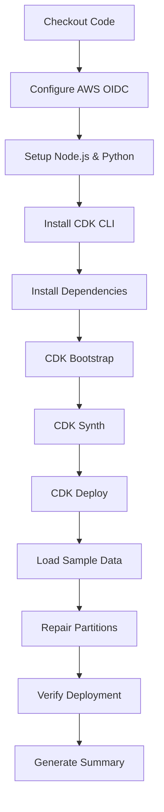
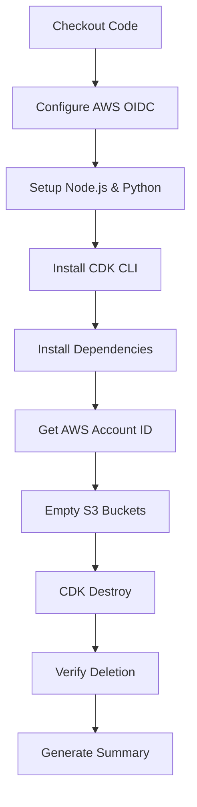

# GitHub Actions Workflow Architecture

## Overview

The Mobiltex Data Lake project uses a **dual-job GitHub Actions workflow** that separates deployment and destruction operations for better organization, security, and reliability.

---

## Workflow Structure

### File Location
`.github/workflows/deploy.yml`

### Trigger Mechanism
```yaml
workflow_dispatch:
  inputs:
    action:
      type: choice
      options:
        - deploy
        - destroy
```

**User selects action → Appropriate job runs**

---

## Job Architecture

### Two Separate Jobs

```
┌─────────────────────────────────────────────┐
│         workflow_dispatch (manual)          │
│                                             │
│  Input: action = "deploy" or "destroy"     │
└──────────────────┬──────────────────────────┘
                   │
        ┌──────────▼──────────┐
        │  Conditional Split   │
        └──────────┬──────────┘
                   │
        ┌──────────▼──────────────┐
        │                         │
   ┌────▼─────┐          ┌────────▼─────┐
   │  deploy  │          │   destroy    │
   │   job    │          │     job      │
   └──────────┘          └──────────────┘
```

---

## Job 1: Deploy

**Runs when:** `action == 'deploy'`

### Steps Overview



### Detailed Steps

1. **Checkout code** (`actions/checkout@v5`)
   - Clones repository to runner

2. **Configure AWS credentials** (`aws-actions/configure-aws-credentials@v5`)
   - Uses OIDC to assume IAM role
   - Session: `GitHubActions-Deploy-{run_id}`

3. **Setup Node.js** (v18) and **Python** (v3.9)
   - Required for CDK CLI and Python scripts

4. **Install AWS CDK CLI**
   ```bash
   npm install -g aws-cdk
   ```

5. **Install Python dependencies**
   ```bash
   pip install -r requirements.txt
   ```

6. **CDK Bootstrap** (if needed)
   - Initializes CDK toolkit stack
   - Only runs if not already bootstrapped

7. **CDK Synth**
   ```bash
   cdk synth
   ```
   - Validates CloudFormation template

8. **CDK Deploy**
   ```bash
   cdk deploy --require-approval never --all
   ```
   - Creates all infrastructure

9. **Load Sample Data**
   ```bash
   pip install pyarrow s3fs
   python3 load_sample_data.py
   ```
   - Uploads Parquet files to S3

10. **Repair Partitions**
    ```bash
    MSCK REPAIR TABLE mobiltex_datalake.readings;
    ```
    - Discovers partitions in Glue

11. **Verify Deployment**
    ```bash
    ./verify_deployment.sh
    ```
    - Runs comprehensive checks

12. **Generate Deployment Summary**
    - Creates GitHub step summary with:
      - Resources created
      - Next steps
      - Query examples

---

## Job 2: Destroy

**Runs when:** `action == 'destroy'`

### Steps Overview



### Detailed Steps

1. **Checkout code** (`actions/checkout@v5`)

2. **Configure AWS credentials** (`aws-actions/configure-aws-credentials@v5`)
   - Session: `GitHubActions-Destroy-{run_id}`

3. **Setup Node.js** and **Python**

4. **Install AWS CDK CLI**

5. **Install Python dependencies**

6. **Get AWS Account ID**
   ```bash
   ACCOUNT_ID=$(aws sts get-caller-identity --query Account --output text)
   echo "account_id=${ACCOUNT_ID}" >> $GITHUB_OUTPUT
   ```
   - Stored for use in subsequent steps

7. **Empty S3 Buckets** ⭐ **CRITICAL STEP**

   This step empties all three S3 buckets:
   - `mobiltex-datalake-raw-{account_id}`
   - `mobiltex-datalake-curated-{account_id}`
   - `mobiltex-athena-results-{account_id}`

   **Why this is necessary:**
   - AWS CloudFormation cannot delete non-empty S3 buckets
   - Versioning is enabled, so must delete all versions
   - Delete markers must also be removed

   **Process for each bucket:**
   ```bash
   # 1. Delete all current objects
   aws s3 rm "s3://${bucket}" --recursive

   # 2. Delete all object versions
   aws s3api list-object-versions --bucket "${bucket}" \
     --query '{Objects: Versions[].{Key:Key,VersionId:VersionId}}' | \
   jq -r '.Objects[]? | "--key \"\(.Key)\" --version-id \"\(.VersionId)\""' | \
   while read -r line; do
     aws s3api delete-object --bucket "${bucket}" $line
   done

   # 3. Delete all delete markers
   aws s3api list-object-versions --bucket "${bucket}" \
     --query '{Objects: DeleteMarkers[].{Key:Key,VersionId:VersionId}}' | \
   jq -r '.Objects[]? | "--key \"\(.Key)\" --version-id \"\(.VersionId)\""' | \
   while read -r line; do
     aws s3api delete-object --bucket "${bucket}" $line
   done
   ```

8. **CDK Destroy**
   ```bash
   cdk destroy --force --all
   ```
   - Now succeeds because buckets are empty

9. **Verify Buckets Deleted**
   - Checks each bucket no longer exists
   - Reports any remaining buckets

10. **Generate Destruction Summary**
    - Documents cleanup process
    - Lists removed resources

---

## Key Differences Between Jobs

| Aspect | Deploy Job | Destroy Job |
|--------|-----------|-------------|
| **Session Name** | `GitHubActions-Deploy-{run_id}` | `GitHubActions-Destroy-{run_id}` |
| **Account ID** | Inline usage | Stored in step output |
| **Critical Step** | Data loading | Bucket emptying |
| **Verification** | Full deployment check | Bucket deletion check |
| **Duration** | ~5 minutes | ~3 minutes |

---

## Why Separate Jobs?

### 1. **Clear Separation of Concerns**
```
Deploy:   Create → Load → Verify
Destroy:  Empty → Delete → Verify
```

### 2. **Independent Execution**
- Only one job runs at a time
- No conditional logic within steps
- Cleaner logs and easier debugging

### 3. **Different Permissions Needs**
- Deploy: Write permissions to create resources
- Destroy: Delete permissions + S3 object deletion

### 4. **Error Isolation**
- Deploy failure doesn't affect destroy logic
- Destroy failure clearly shows at which step

### 5. **Audit Trail**
- Separate job logs for compliance
- Easy to track what happened in each operation

---

## Bucket Emptying Deep Dive

### Why Empty Buckets Manually?

**Problem:**
```
CDK destroy → CloudFormation tries to delete bucket
              → Bucket has objects
              → Deletion fails ❌
```

**Solution:**
```
Empty buckets first → All objects removed
                    → All versions removed
                    → All delete markers removed
                    → CDK destroy succeeds ✅
```

### Three-Phase Deletion

#### Phase 1: Current Objects
```bash
aws s3 rm "s3://bucket-name" --recursive
```
Deletes all current object versions

#### Phase 2: Old Versions
```bash
list-object-versions → Get all version IDs
                     → Delete each version individually
```
Deletes all previous versions (versioning enabled)

#### Phase 3: Delete Markers
```bash
list-object-versions → Get all delete markers
                     → Remove each marker
```
Removes tombstone markers from deleted objects

### Bucket Emptying Function

```bash
empty_bucket() {
  local bucket=$1

  # Check bucket exists
  if aws s3 ls "s3://${bucket}" 2>/dev/null; then

    # Phase 1: Current objects
    aws s3 rm "s3://${bucket}" --recursive

    # Phase 2: All versions
    aws s3api list-object-versions --bucket "${bucket}" \
      --output json \
      --query '{Objects: Versions[].{Key:Key,VersionId:VersionId}}' | \
    jq -r '.Objects[]? | "--key \"\(.Key)\" --version-id \"\(.VersionId)\""' | \
    while read -r line; do
      if [ -n "$line" ]; then
        eval aws s3api delete-object --bucket "${bucket}" $line
      fi
    done

    # Phase 3: Delete markers
    aws s3api list-object-versions --bucket "${bucket}" \
      --output json \
      --query '{Objects: DeleteMarkers[].{Key:Key,VersionId:VersionId}}' | \
    jq -r '.Objects[]? | "--key \"\(.Key)\" --version-id \"\(.VersionId)\""' | \
    while read -r line; do
      if [ -n "$line" ]; then
        eval aws s3api delete-object --bucket "${bucket}" $line
      fi
    done

    echo "✅ ${bucket} emptied successfully"
  fi
}
```

---

## Workflow Execution Examples

### Example 1: Successful Deploy

```
Trigger: User selects "deploy"

Job: deploy (5m 23s)
├─ ✅ Checkout code (2s)
├─ ✅ Configure AWS credentials (1s)
├─ ✅ Setup Node.js (3s)
├─ ✅ Setup Python (2s)
├─ ✅ Install CDK CLI (12s)
├─ ✅ Install dependencies (8s)
├─ ✅ CDK Bootstrap (5s)
├─ ✅ CDK Synth (3s)
├─ ✅ CDK Deploy (180s)
├─ ✅ Load Sample Data (15s)
├─ ✅ Repair Partitions (5s)
├─ ✅ Verify Deployment (8s)
└─ ✅ Generate Summary (1s)

Summary:
🚀 Deployment Summary
- AWS Account: 123456789012
- Region: us-east-1
- Resources: 3 S3 buckets, 1 Glue DB, 3 tables, 1 Athena WG
```

### Example 2: Successful Destroy

```
Trigger: User selects "destroy"

Job: destroy (3m 12s)
├─ ✅ Checkout code (2s)
├─ ✅ Configure AWS credentials (1s)
├─ ✅ Setup Node.js (3s)
├─ ✅ Setup Python (2s)
├─ ✅ Install CDK CLI (12s)
├─ ✅ Install dependencies (8s)
├─ ✅ Get AWS Account ID (1s)
├─ ✅ Empty S3 Buckets (45s)
│   ├─ Empty mobiltex-datalake-raw-123456789012 (15s)
│   ├─ Empty mobiltex-datalake-curated-123456789012 (18s)
│   └─ Empty mobiltex-athena-results-123456789012 (12s)
├─ ✅ CDK Destroy (95s)
├─ ✅ Verify Deletion (3s)
└─ ✅ Generate Summary (1s)

Summary:
🗑️ Destruction Summary
- Buckets emptied: 3
- Versions deleted: 156
- CloudFormation stack: Deleted
```

---

## Security Considerations

### OIDC Session Naming
```yaml
Deploy:  GitHubActions-Deploy-{run_id}
Destroy: GitHubActions-Destroy-{run_id}
```
- Unique session per run
- Easy to track in CloudTrail
- Automatic expiration after workflow

### Permissions Required

**Deploy Job:**
- `cloudformation:CreateStack`
- `s3:CreateBucket`
- `s3:PutObject`
- `glue:CreateDatabase`
- `iam:CreateRole`

**Destroy Job:**
- `s3:ListBucket`
- `s3:DeleteObject`
- `s3:DeleteObjectVersion`
- `s3:DeleteBucket`
- `cloudformation:DeleteStack`

---

## Monitoring & Debugging

### View Workflow Logs
```
GitHub → Actions → Deploy Mobiltex Data Lake → Run #N
```

### Common Issues

**Issue 1: Bucket not empty error**
```
Error: Cannot delete bucket: BucketNotEmpty
```
**Solution:** Check "Empty S3 Buckets" step completed successfully

**Issue 2: Version deletion fails**
```
Error: Access Denied deleting version
```
**Solution:** Ensure IAM role has `s3:DeleteObjectVersion` permission

**Issue 3: OIDC authentication fails**
```
Error: Unable to assume role
```
**Solution:** Verify trust policy allows GitHub repository

---

## Performance Optimization

### Parallel Step Execution
Within each job, steps run sequentially, but multiple API calls within a step can run in parallel:

```bash
# Parallel bucket emptying
empty_bucket "${RAW_BUCKET}" &
empty_bucket "${CURATED_BUCKET}" &
empty_bucket "${ATHENA_BUCKET}" &
wait
```

### Caching
Consider adding caching for faster runs:
```yaml
- uses: actions/cache@v3
  with:
    path: ~/.npm
    key: ${{ runner.os }}-node-${{ hashFiles('**/package-lock.json') }}
```

---

## Future Enhancements

1. **Manual Approval for Destroy**
   ```yaml
   environment:
     name: production
     url: https://console.aws.amazon.com
   ```

2. **Slack Notifications**
   - Notify team on deploy/destroy

3. **Cost Estimation**
   - Show estimated AWS costs before deploy

4. **Drift Detection**
   - Check for manual changes before deploy

---

## Documentation Links

- **Workflow File:** `.github/workflows/deploy.yml`
- **CI/CD Setup:** [CICD_SETUP.md](./CICD_SETUP.md)
- **Deployment Options:** [DEPLOYMENT_OPTIONS.md](./DEPLOYMENT_OPTIONS.md)

---

*Last Updated: 2025-10-26*
